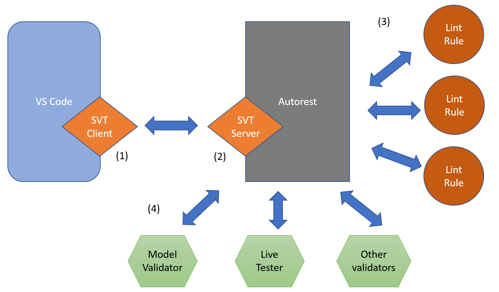
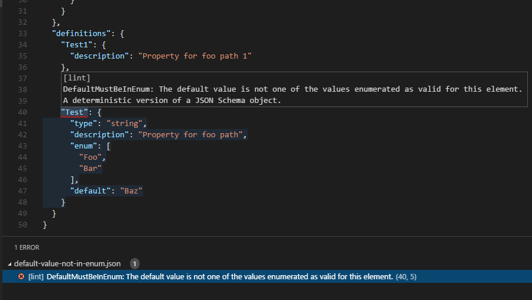
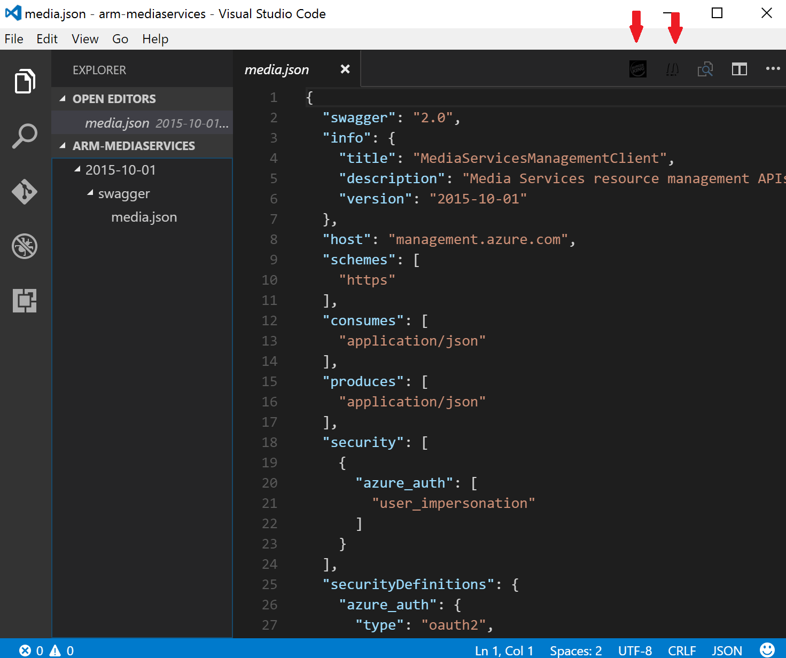
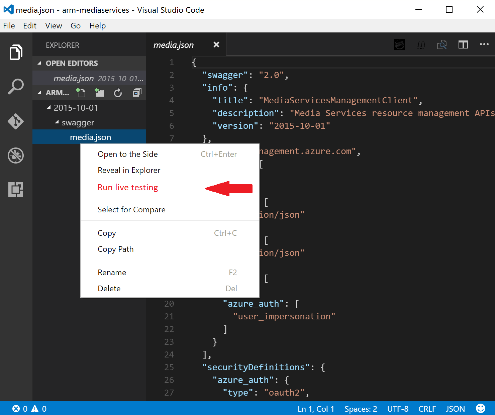

# Swagger Validation Tools VS Code Extension

## Objectives and High-level plan

We plan on building a one-stop shop vs-code extension that will help the swagger authors get live and prompt feedback on the quality and correctness of their swaggers. We plan on reusing and building on top of the work that was done for the Autorest Linter VS code extension and integration our tools Autorest to simplify the users experience.

## Overall architecture

The following diagram provides a high-level architecture of the proposed SVT (Swagger Validation tools) VS Code extension.

1. 1)SVT VS Code extension&#39;s client: the client is the implementation of UI and experience of the swagger authoring, details will follow later in the document on the proposed user experience. The swagger tooling team will take ownership of this component.

1. 2)SVT VS Code server component: The Autorest team will be owning this component and the current plan is to:

1.
  1. Load up Autorest in memory of the machine where VS Code resides.
  2. Investigate a way to include the server logic or process within Autorest (basically turn Autorest into the server) to improve performance.
  3. Define a clear interface for the different operations and calls that the client side will need to trigger different validation tools.

1. 3)Pluggable linter rules: the Autorest team will be working on a design and interface to allow anyone to contribute static linting rules in a more scalable (not directly authored into the code) way. The swagger volition tools team or anyone from the services team will be able to contribute to the rules as they see fit.

1. 4)Pluggable Validation tools: The swagger tooling team will mainly be responsible for building these tools except for the linter which will continue to be owned by the Autorest team, but that wouldn&#39;t stop contribution from anyone else. in the efforts of simplifying the user experience and potentially simplifying the process of integrating our tools with any IDE in the future (such as Visual Studio), all the validation tools will be hooked up to extension points on Autorest which is currently work in progress on Autorests side. Our tools can all be run through simple commands but we&#39;re committed to update them to adhere with any integration requirements from Auto-rest.

## Standardizing validation tools output structure

All the validation tools including the linter will be updated to output the same messaging structure. This will allow us to build parsers, analytics and potentially visualizers that are reusable across all our tools. The swagger tooling team will be working with the Autorest team on the messaging specs but so far we agree on that types of information that it will be providing, including:

- --Unified format (JSON)
- --Tool Identification (linter, model validator)
- --category: error or warning, info …etc
- --Line, column &amp; location info
- --Short description
- --Detailed description
- --Intellisense
- --Fix it recommendations.

Not all tools will be able to offer all this information and some tools may provide extra info but we&#39;ll be defining a minimum set of parameters that should be provided.

## Swagger Validation tools UI and Specs

For our v0.1 our focus will be more on the richness of the functionality that extension offer rather than the beatification of it. As we build this initial proto-type and start sharing it with users, we will be collecting feedback on the user experience and work towards the optimal user experience.

### Swagger Validation tools types

Our classification of the tools will be based on how expense the tool is to run and whether all the information required for the validation is contained within the swagger itself or not.

1. 1)On the fly static validation tools: a good example is the linter, all the info required for validation is self-contained within the swagger and It&#39;s relatively inexpensive to process on the fly.

The current user experience of the linter vs code extension is very simple and straight forward and we&#39;re planning on keeping this experience and extend it to cover other similar tools such as the semantic validator. To summarize it:

- --The user opens VS code and creates a new Swagger or edits an existing one.
- --As he&#39;s typing, in the background the SVT extension&#39;s client will be calling the extension&#39;s server (which is basically Autorest) and uploading the updated swagger content.
- --The swagger server will trigger the configured and registered tools for &quot;only the fly validation&quot; and return the standardized messages If applicable.
- --The client will process the response messages and depending on the content, either take no action or:
  - Update the console with the list of errors or warnings
  - Underline the erroneous area with swiggles and provide tips.

The snapshot in figure (2) below provides an example of this experience.

 

Figure (2) on the fly validation experience (taken from the current linter extension)

1. 2)Long running validation: a good example of this type of tools would be the live testing swagger validator. This tool picks up all sample request &amp; response payloads for the operations defined in the swagger, runs the sample request against the service and finally matches &amp; validates the response payload returned from the service to the sample response payload provided in the swagger.

Running this type of validation continuously and on the fly will be very expensive, so the experience that we&#39;re proposing here is:

- --The user creates a new swagger or edits an existing one in VS code.
- --As the user updates the document no requests will be sent to Autorest to fire up long running validation tools.
- --When the user is ready to run a specific long running validation tools he will trigger it by:
  - Selecting the JOSON file or giving it focus in VS Code.
  - Clicking the tool&#39;s specific command button on the navigation as shown in figure (3) below, and yes these are **McDonalds** and **Burger King** Icons for now LOL (apologies this is the best of my photoshop skills ).
  - Alternatively the user can right click on the JSON file in the file explorer and select the tool specific command as shown in figure (4) below.
- --The request will go to Autorest and the response with all the errors and warnings will be returned and displayed in the VS code console similar to the current behavior of the linter&#39;s extension. swiggles will also be displayed under the location of the violation with hints displayed when the users hovers over them.

 

 (Figure 3) Trigger long running validations through navigation bar commands

 

Figure (4) trigger long running operations through the file explorer&#39;s context menu
